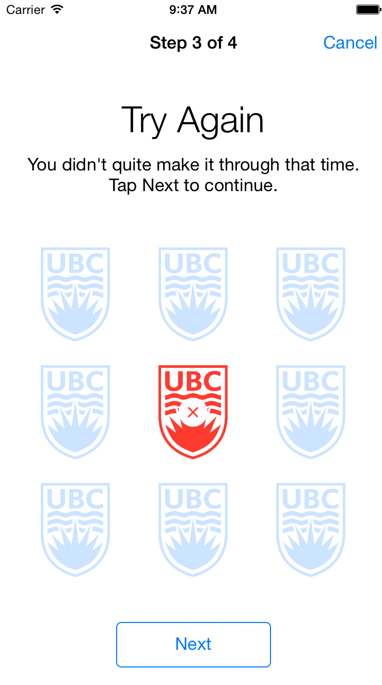
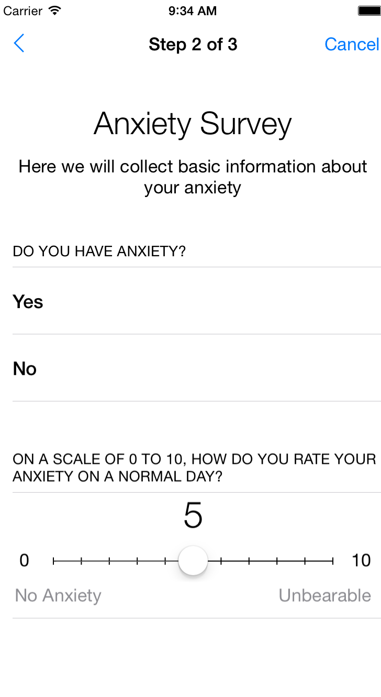
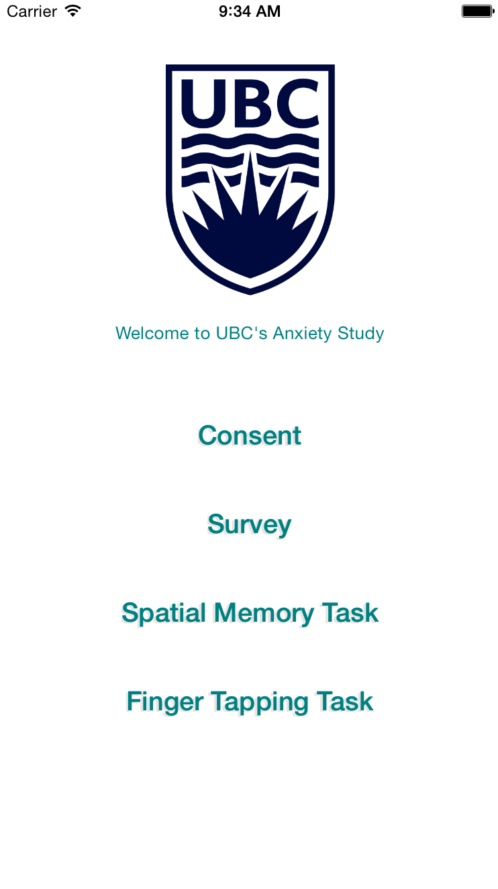

# AnxietyResearch
Objective-C ResearchKit (without AppCore) demo app

All code currently in ViewController, to be refactored at a later date.

This demo app uses ResearchKit only and does not use AppCore.

Most survey types are demonstrated including Form Items.

Two active tasks are demonstrated: Finger Tapping and Spatial Span Memory.

  

  
